# Analyzing insurance claims using IBM Db2 graph

As the volume of data grows, it has become a challenge to analyze these vast network of connected data. To overcome this challenge there is a rapid adoption to graph database technologies, since they’re built around relationships and represent data in a way that is more intuitive to read and gain insights.

There are a number of graph databases that handle graph only use cases well, however enterprises require analytic systems that can perform data transformations, aggregations and other operations in addition to graph analytics. While graph databases perform exceptionally well for certain types of analyses, they are not suitable for workloads that involve aggregation over a large amount of data, they are not the best at transactional processing and don’t scale well. Most existing graph databases are stand-alone and cannot easily integrate with these other analytics systems.

In this code pattern, we will learn about IBM Db2 Graph that will enable Graph analytics on top of Db2, allowing you to perform Graph analytics and SQL (for transactional processing, transformations, BI and other analytics use cases) on the same copy of data, without data duplication or requiring any changes to the underlying database structure.

Db2 Graph will create a virtual graph view of the underlying data using the existing relationships already defined in Db2. Alternatively, you can create your own graph model, by defining how the tables and views already defined in Db2, map into nodes and edges in your graph.

Db2 Graph then exposes the graph model so you can execute Gremlin queries. Db2 Graph fetches only the necessary data from Db2 at the time of query execution, so any updates made to data in Db2 will be reflected.

At the end of this code pattern, users will be able to:
* Load data to IBM Db2 instance on cloud.
* Create a IBM Db2 Graph instance running locally.
* Connect IBM Db2 Graph to IBM Db2 instance on cloud and create graph database.
* Run gremlin queries on top of the IBM Db2 database.
* Analyze the data using Jupyter notebook.

The theme of this code pattern is built around data of a insurance provider, which collects patients, diseases and claims data.


## Flow
1. User loads or use existing data to/from IBM Db2 database.
2. Connect IBM Db2 Graph to IBM Db2 database.
3. Run gremlin queries using IBM Db2 Graph.
4. Analyze the data using Jupyter notebook.


## Included Components
* IBM Db2 Graph
* IBM Db2 Database
* Apache Tinkerpop

## Featured Technologies
* Python
* Juypter notebook
* Anaconda

## Steps

1. [Clone the repo](#1-clone-the-repo)
1. [Create IBM Db2 service on cloud](#2-create-ibm-db2-service-on-cloud)
1. [Create schemas and load data](#3-create-schemas-and-load-data)
1. [Run IBM Db2 Graph locally](#4-run-ibm-db2-graph-locally)
1. [Connect IBM Db2 graph with IBM Db2 database](#5-connect-ibm-db2-graph-with-ibm-db2-database)
1. [Run gremlin queries](#6-run-gremlin-queries)
1. [Install Anaconda environment to run notebooks](#7-instal-anaconda-environment-to-run-notebooks)
1. [Configure IBM Db2 driver](#8-configure-ibm-db2-driver)
1. [Run Notebooks to view visualizations](#9-run-notebooks-to-view-visualizations)


> NOTE: Create an [IBM Cloud](https://cloud.ibm.com/registration) account, if you do not have one already

## 1. Clone the repo

```bash
git clone https://github.com/IBM/analyzing-insurance-claims-using-ibm-db2-graph
```

## 2. Create IBM Db2 service on cloud

To create your IBM Db2 service on IBM cloud by going to https://cloud.ibm.com:

* From your IBM Cloud dashboard, click on `Create resource`.

* Search the catalog for `db2`.

* Click the `IBM Db2` tile to launch the create panel.

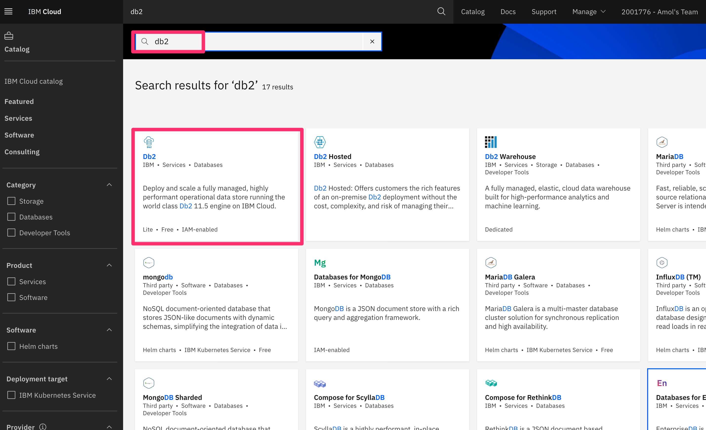


* From the panel, enter a unique name, a region and a plan type (select the default `lite` plan). Click `Create` to create and enable your service.

* From the right hand navigation, click `Service credentials`, and create a `New credentials`. Save the credentials to be used for upcoming steps.

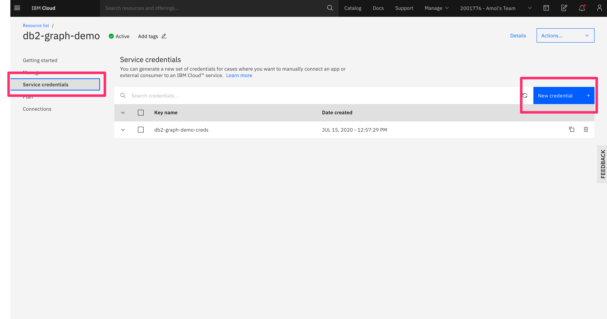

## 3. Create schemas and load data

To load data to IBM Db2 service that you just create go to `Manage` from right navigation and click `Open Console`. This will take you to the IBM Db2 database console.

### 3.1. Create Database schema and tables

From the hamburger menu, click `RUN SQL`, copy and paste [Create Table SQL](data/CreateTables.sql) in the run sql editor. From the bottom drop down, click and run `Run all`

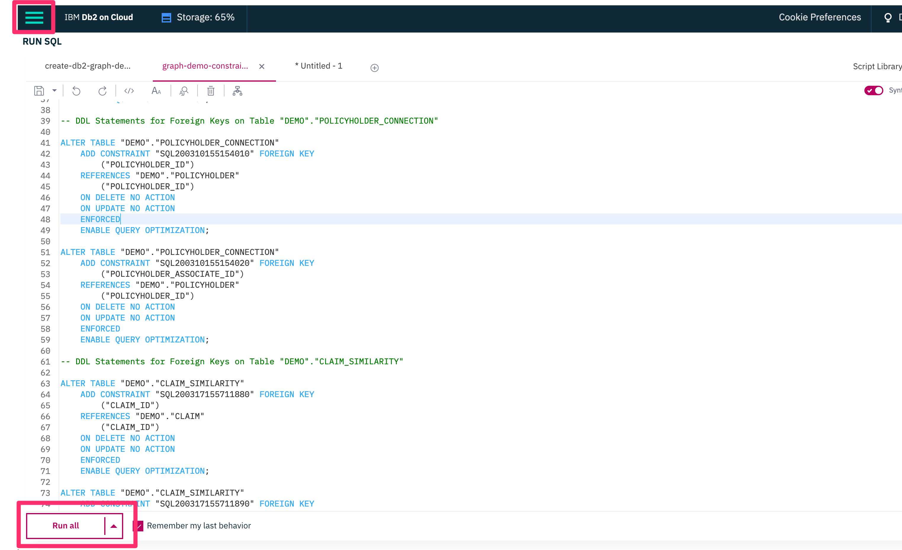

The sql script will create `DEMO` schema and all necessary tables for the insurance data that will be used to analyze the claims.

### 3.2 Load data to the database

To load data, click the hamburger menu, and select load data. In that page you can drag and drop your csv files from the `data` directory one at a time and select required table in subsequent steps to load the data. 

For an example, lets load [Claim CSV](data/CLAIM.CSV) data to the Db2 database in `DEMO.CLAIM` table.

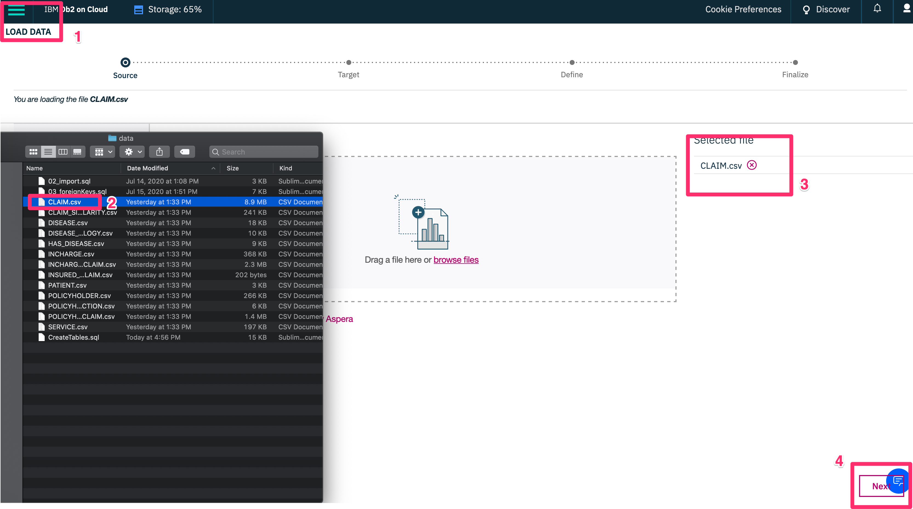

In the above diagram:
1. Click `LOAD DATA` from hamburger menu.
2. Drag and drop the csv file to the browse files section of the browser.
3. You will see that the file has been added for upload.
4. Click `Next`

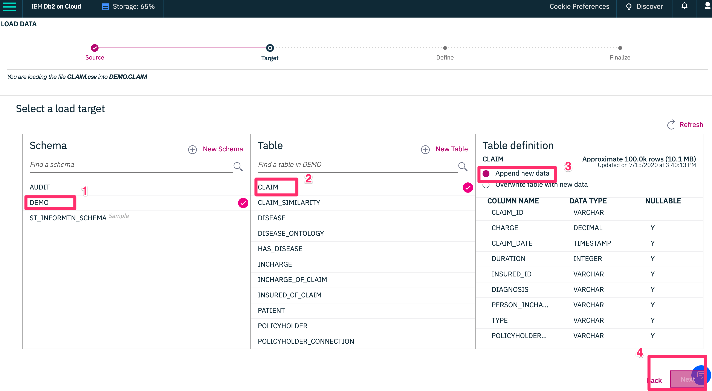

1. Select the schema `DEMO`
2. Choose the correct table where the data goes to, which in this case is `CLAIM`
3. Choose to either `Append new Data` or `Overwrite table with new data`. Since in this case you are uploading for first time either option is fine.
4. Click `Next`

In the next screen make sure the datatype and data are correct and click `Next`

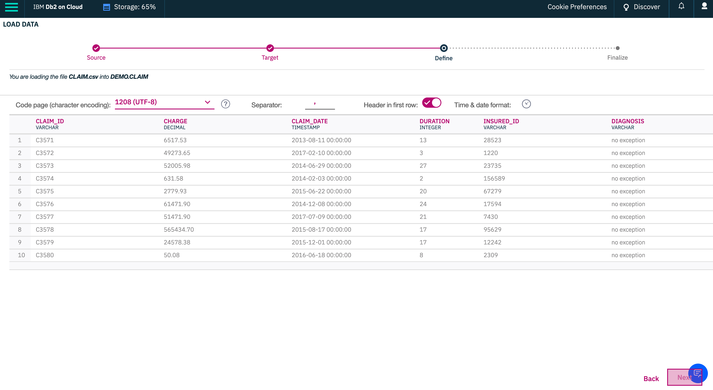

And in final step, click `Begin Load` to load data to the `ClAIM`
table.

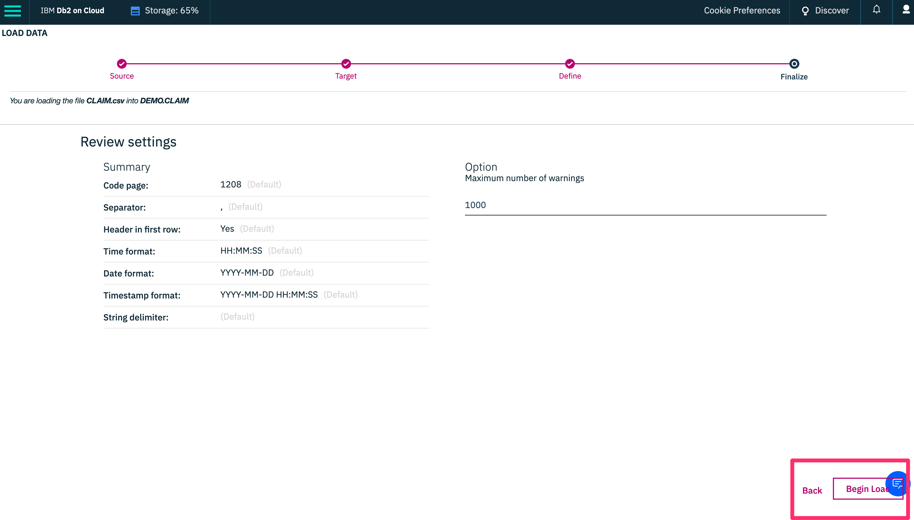

Once the load is successful you will see the confirmation screen to see how many rows were inserted and if the load was successfull.

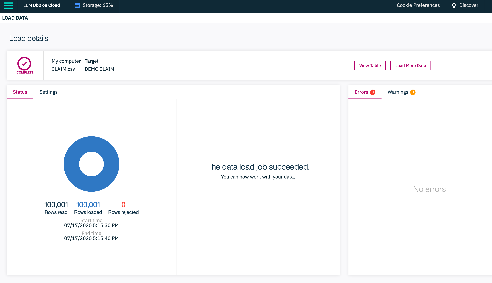

you need to repeat the same above steps for all the data in our data directory which are:
```
CLAIM_SIMILARITY, DISEASE, DISEASE_ONTOLOGY, HAS_DISEASE, INCHARGE,
 INCHARGE_OF_CLAIM, INSURED_OF_CLAIM, PATIENT, POLICYHOLDER, 
 POLICYHOLDER_CONNECTION, POLICYHOLDER_OF_CLAIM, SERVICE
```

### 3.3 Alter tables to add constraints

Run the script to alter [Foreign Keys](data/ForeignKeys.sql).

1. Click `RUN SQL` from hamburger menu
2. Copy and paste the script and click `Run all` from the dropdown that is located in bottom left of the page.


## 4. Run IBM Db2 Graph locally

1. Install the IBM Cloud command line tools following the directions at `https://cloud.ibm.com/docs/cli?topic=cli-getting-started`

2. Log into the IBM Cloud system:
    * Run `ibmcloud login -a cloud.ibm.com -sso` from a command line and follow the instructions for entering your authentication  code
    * Press Enter to skip selecting a region
    * Note: You may get a warning about not being in a resource group; it is safe to ignore the warning
    * Enter a choice for sending usage metrics to IBM

3. Update to the latest container registry plugin
    * Run `ibmcloud plugin update container-registry` from the command line window

4. To download and run the Db2 Graph container you need to:
    * Log into the container registry: 
        * Run `ibmcloud cr region-set global` from the command line window
        * Run `ibmcloud cr login` from the command line window
    * If you have a previous install of Db2 Graph
        * Run `docker stop db2graph` to stop the current container
        * Run `docker rm db2graph` to remove the stopped container
        * Optionally delete `/host/machine/path/to/persisted/configuration/directory` from your previous install to start from a clean system, otherwise existing configuration and graphs are preserved
    * Pull the container
        * Run `docker pull icr.io/ibm/hdm/db2graph:latest-amd64` from the command line window
    * Run the container
        * Copy the following command to either a terminal window or text editor, but do not run it 

        ```
        docker run -it --hostname localhost -v /host/machine/path/to/persisted/configuration/directory:/db2graph/ -p 8182:8182 --name=db2graph -e LICENSE=view icr.io/ibm/hdm/db2graph:latest-amd64
        ```

        * Set the value of `hostname_from_host_machine` to match the hostname of the system you are executing the command on. The hostname value is used when generating the openssl certificate on the first run of the container.
        * Set the value of `/host/machine/path/to/persisted/configuration/directory` to a location for Db2 Graph to persist files on the host machine
        * Run the updated command in your terminal

5. When the container is first deployed, the Db2 Graph server is not yet started. You can confirm that by executing the following command to get the status. See the manage command for more information on the status sub-command.

`docker exec -it db2graph manage status`

Before you can start the server, you must change the password for `graph_user`. This `graph_user` is a default user that provides access to the Db2 Graph server from your application. See the manage command for more information on the user sub-command.

`docker exec -it db2graph manage user`

Once the password has been set update the `gremlin/remote-secure.yaml` file from the persisted configuration directory and set the password field to match your new password.

To do that login to your container by running:
`docker exec -it db2graph bash` and vi `gremlin/remote-secure.yaml` and update the password.

## 5. Connect IBM Db2 graph with IBM Db2 database

To access  IBM Db2 database from Db2 Graph that you created in previous step, you start by adding a graph overlay using the `add` command. See the manage command for more information on the add sub-command as well as the related list and remove sub-commands. 

`docker exec -it db2graph manage add`
        
>NOTE: If you choose to filter to a specific schema when prompted, remember that schema names in Db2 are case sensitive. See below for add command details.

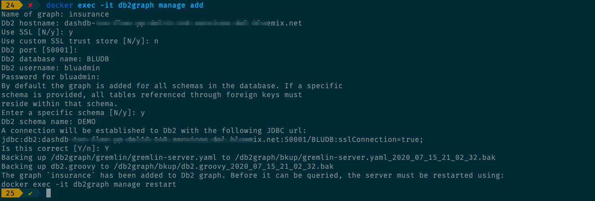

## 6. Run gremlin queries

Db2 Graph also includes the gremlin-console which is a REPL (read-eval-print-loop) console for gremlin queries. While the gremlin console allows you to interact with Db2 Graph, normally you would develop an external application, using Jupyter Notebook, Python, JavaScript or any of the programming languages supported by Tinkerpop to execute graph queries. The gremlin console has been pre-configured to support connecting to the server included with the Db2 Graph container. To access the console run:

* `docker exec -it db2graph /db2graph_container_files/gremlin-console/bin/gremlin.sh`
* Once you are inside the gremlin-console you can connect to the server by running:
    * `:remote connect tinkerpop.server /db2graph/gremlin/remote-secure.yaml`
    * `:remote console`
* These commands open a session with the server and allow you to execute queries against the graphs that you added with `docker exec -it db2graph manage add`. Db2 Graph automatically opens a traversal for each graph that you have added with the name that you gave to it, and these are already available for use when you establish a remote connection. For example, if you added a graph called insuracen in step 5,  you can execute queries such as:
    * `insurance.V().hasLabel('DEMO.CLAIM').has('CLAIM_ID', 'C4377')`
    * The above query will give you a claim with id `C4377`

## 7. Install Anaconda environment to run notebooks

### Python Setup
The IBM Db2 Graph sample data contains a set of Jupyter Notebooks to run graph queries and visualize the results. There are specific package versions required for these notebooks and it is recommended you use [miniconda](https://docs.conda.io/en/latest/miniconda.html) to create a graph demo environment:

Run the following commands
* conda update conda
There is a current open defect with conda that may affect MacOS users. The workaround is to create a symlink in your conda installation:
```
cd <path_to_miniconda>/lib && ln -s libffi.dylib libffi.6.dylib
ex: cd ~/miniconda3/lib && ln -s libffi.dylib libffi.6.dylib

conda create -n graphdemo python=3.6

conda activate graphdemo

pip install --no-cache-dir gremlinpython==3.4.4 ibm_db pandas jupyterhub==0.8.1 notebook==5.7.8 nbfinder 

```

## 8. Configure IBM Db2 driver

IBM Db2 driver (ibm_db) requires gcc. Ensure gcc is installed prior to executing.
If you are using MacOS please see https://github.com/ibmdb/python-ibmdb/blob/master/IBM_DB/ibm_db/README.md#issues-with-mac-os-x for proper setup of the Python Db2 driver. Note that the library location is relative to the conda install, for example export DYLD_LIBRARY_PATH=/Users/<user>/miniconda3/envs/graphdemo/lib/python3.6/site-packages/clidriver/lib
    
```
cd <directory where you extracted the the sample notebooks>
jupyter notebook
```
If you are hosting the demo on a remote machine make sure the remote machine is setup to forward connections to the jupyter notebook server.
Before proceeding to run any of the notebooks you need to edit the connect_info notebook and provide the Db2 graph server and Db2 database server connection information.

You can access the notebooks from URL:
`http://localhost:8888`

## 9. Run Notebooks to view visualizations

The repository contains two notebooks that we will be using for connecting to IBM Db2 graph and visualization.

### 1. Prepare connection details

In [connect_info.ipynb](notebooks/connect_info.ipynb), it contains credentials to connect to IBM Db2 database on cloud and IBM db2 graph that you have saved and configured on previous steps. Fill in the details and run the notebook.

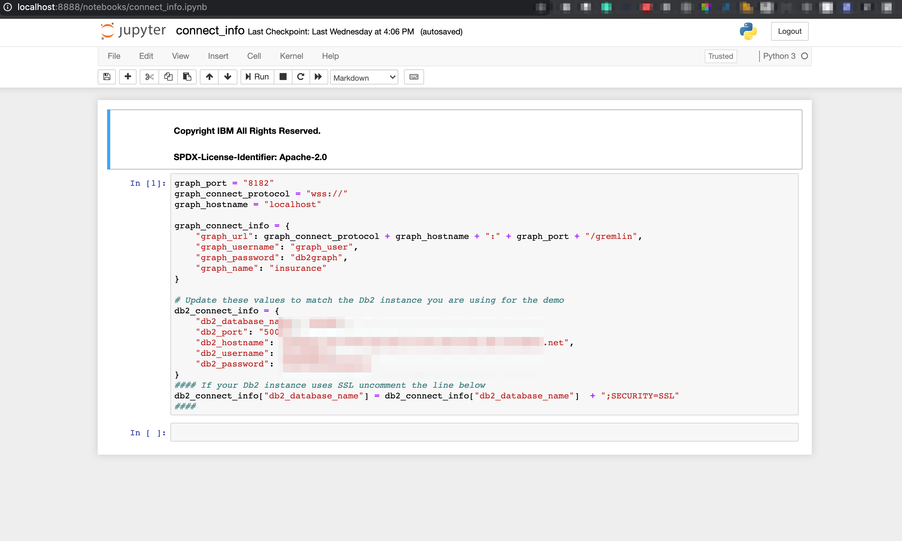

### 2. Run the visualization details

In [InsuranceClaimVisualizations.ipynb](notebooks/InsuranceClaimVisualizations.ipynb), Run each cells at a time to visualize. Following are the visualization you can see in the notebook.

#### a. Data from db2 that has fraud claims

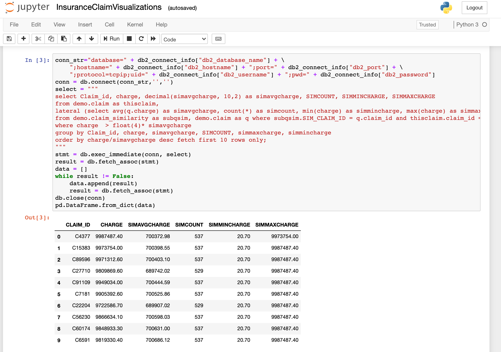

In this cell output, you will see that Claim 4377 as being suspicious. We can see that the charge for this type of claim is almost 300k over the average charge for this type.

You now need to dig deeper to find out what is going on and we will use Db2 Graph to do that.

#### b. Finding all the claims by the Policyholder


